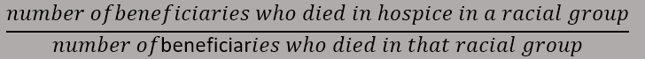
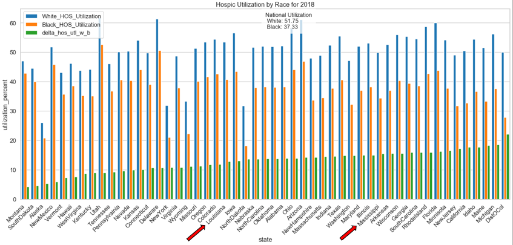
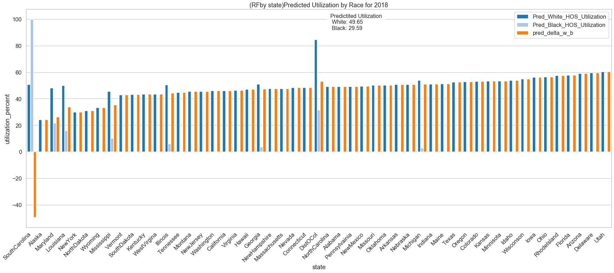
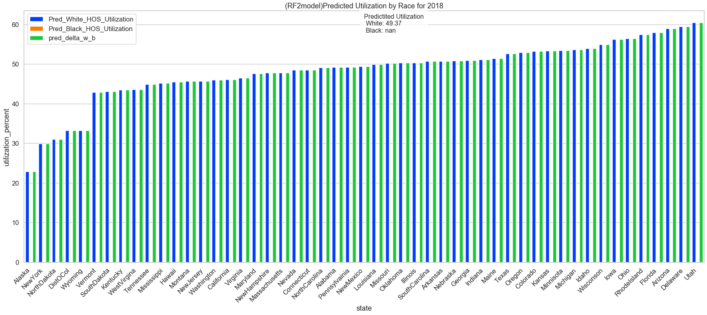
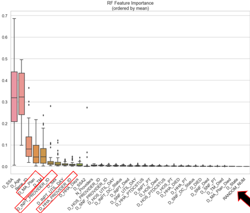
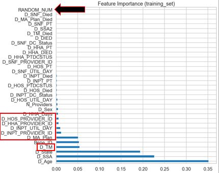
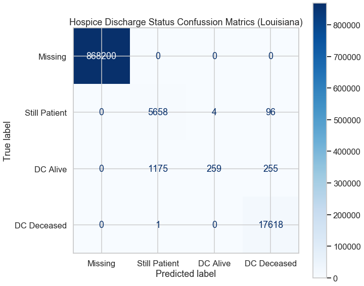
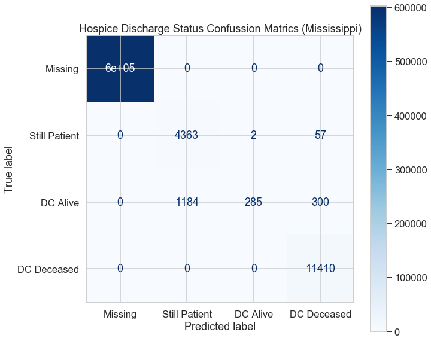

# Hospice Utilization by Minorites  
## J. Patrick Bernard  
## Regis University
## MSDS696 DataSciencePracticum 2

### Purpose  
The purpose of my project is to investigate the utilization of hospice care by minority racial groups. There is a history of racial groups having lower levels of access to medical care, is also true for hospice care? My goal is not to explain why or how this is occurring, that is the job of social and healthcare professionals. My goal is to collect and evaluate the data so that these professionals can direct their effort in the best way possible.  The region of concern will be Louisiana and Mississippi.   
### Data Source  
2018 Medicare hospice claims. 
### Assumptions
This study will not determine the cause of any identified discrepancies.  This study will only identify and inform those professionals that are better equipped to determine a cause.   
A concern I have is I will not have enough computing resources to process all of the data. I endeavored to use the results of my studies to inform me of my conclusion.  When I make a finding I will use multiple data points and methodologies to backup the conclusions that I and drawn.  

### Data Engineering  
The data for the study comes from 2018 Medicare beneficiary records. there are approximately 65 million record in the data set.  For the study records where limited to the 50 states and the District of Columbia.  To get the data into a size that I could manage on my laptop, I  used a package call Dask to process data in segments.  I group the data in to states and saved them to separate pickle files.  I used pickle files to preserve the data structures for future processing.  I also created summary files to refer to and use for data understanding.  The study will focus on the state of Louisiana and Mississippi when we are not looking at data for the entire country.  
To calculate the hospice utilization by racial group  I divided the number of beneficiaries by racial group  who were discharged deceased (died) from hospice care by the number of beneficiaries that died in that racial group.  

### Hospice Utilization  
Here are the results for the calculation by state.  The blue lines are the percentage of the white population that used hospice care and the orange lines are the percentage of the black population that utilized hospice.  The green line is the delta between the two groups.  The chart is sorted by the delta values.   From the chart we can see that there is a disparity in the utilization of hospice.  We also can see that the disparity varies by state. 

  

### Can the records be classified by race?  
To further understand the utilization can the records be classified by race?  If the race column was not considered could the record be divided into racial boxes?  I choose to use a random forest classifier for this task. I divided the data into training and test sets.  I trained the classifier and then used the trained classifier on the entire data set.  
  
**How model 1 was built**  
- For each state  
-- split the data into a training and a test set  
-- trained the model  
-- Classify thedata set for entire state with the model  
-- Record the feature importance for that model  
-- Save the predicted race for each record  
- Open the summary file and plot the Hospice Utilization by predicted race  

For my first model I operated on each state individually.  I trained a model on the data set, then ran the entire data set through that model.  Once the classification had been made I saved the data.  Once all of the states had been processed I plotted the same utilization chart as before only this time with the predicted classes.  

  

This is a very concerning plot the first time I reviewed it. The classifier is really only identify one group and occasionally a second.  There are very few light blue bars which are the predicted black population.  I expected this model would have been overfit since I used a portion of the data set to train with and then reused that data when I classified the data.  From the chart what I am really seeing is that the model was unable to classify on race accuratly, or even more modestly reasonalbly classify.

**How model 2 was built built**
- Derived a training set of data  
-- 2% of the data used for training  
-- Race distribution represented in the data  
-- Small sample used because of compute limitation  
- Train the model  
- Calculate the model accuracy  
- Determine the feature importance  
- Use the trained model on each states data  
- Plot the predicted hospice utilization  

 To ensure that I created a good model I changed how I created the training data set.  I collected a training set of data from all of the states and ensured that the racial groups were proportionally represented in the training data set.  Because of computing resources the training set is 2% of the entire data set.  I calculated the accuracy of the classifier and created a chart of the feature importance in the classifier.  Once this was done, I ran the classifier on the data set for each state.  
   
  

This model performed worse!!!  It only classified 1 class!  The training accuracy was nearly 80% and that is considered a good start for a Random Forest Classifier.  
### Model Performance  
Both of the models performed poorly when operating on the entire data set. Could augmenting the data help the classification process? Was the training set too small?  **WAIT!!!** Lets review the purpose of this study.  The purpose of this study was to identify any racial disparity in the utilization of hospice care.
I created 2 random forest classifiers that performed poorly and the random forest classifier algorithm is a reputable mathematical tool.  Is it significant that the model is having a hard time classifying using the 2 different way of generating the training data?  The first model, is like giving the questions on the final to study and then giving that same final exam.  Well that didn't go well. The second model was built with a more traditional approach for training data and it too did not perform.  This is significant to me. This means that the two models using different methods of initiation, the data does not have any feature that can classify race reliably.  This then means there is not systemic racism in this data set.   We have identified a disparity that should be addressed.  This could be a cultural or educational issue that could be addressed.  
### Feature Importance  
To better understand the models I plotted the feature importance.  For the first model since each state had its own model I aggregated the result into box plots and for the second model I plot its results.   For the features that were important for classifying I found that there we two groups of data.  The first was the data that described the beneficiary and the data that describe the provider.   When I was building the models I also inserted a random integer for confounding and determining feature importance. The random value feature did not add anything to classification of the data. The data that described the providers could be used in planning an educational campaign by pointing to those place that would get the most impact.  This is a weak conclusion because if you understand how people move through the medical system the first touch points may be a better approach.  
  
  
### Secondary Classification Model  
For my own edification and to get more insight. I took the same sample data from the secnd model and built a classifier for the hospice discharge status.  Here is the confusion matrixes for Louisiana and Mississippi.  This classifier performed much better the cross verification accuracy was 99%.  We can also see that in most cased the classifier did a great job.  I have not dug deeper into where data was mis-classified to understand the cause. A couple of areas that would be interesting to learn more about the differences,predicted still a patient and DC Deceaced.  The classifier thought that the beneficiary was discharged as still a patient but some of them where discharged alive.  In the second case, some where classified as discharged deceased but were discharged alive.  That is for another time.  

  
### Next Steps  
For me, it is time to update my processing environment, a new laptop with GPU support and more RAM and or utilizing cloud based compute services to handle the larger data sets. With a better compute environment, I would like to try a different classifier algorithm (K-mean, T-pot, XGBoost) this could be useful in understanding the data.Use Dask or other packages that will allow for process multi-threddding could also help with the resource utilization. I really only grazed the capability of Dask and other tool like it. I would also like to further pursue the query in the Hospice discharge status.  
### Lessons Learned  
Be careful of the distraction you encounter while doing your research,  I wrote some really amazing code that was not helping me answer the questions of this study, I spend a lot of time doing some feature engineering that will be useful on other projects.  I did go back to some of those ideas, but they did not bear fruit for this study.   I think it important to keep the purpose of the study in mind while working.  When something is not working also consider that as a finding.  This was a study into an area I do not have any real experience with, Using my subject matter experts to understand what the data was saying and how different columns of data are used was very important.  My SME was also instrumental in course correcting, when I was off course and exploring a directions that were not in keeping with the purpose of the study.  

